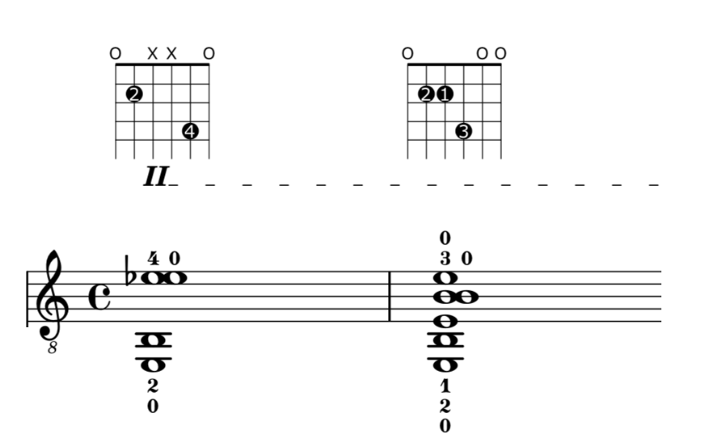
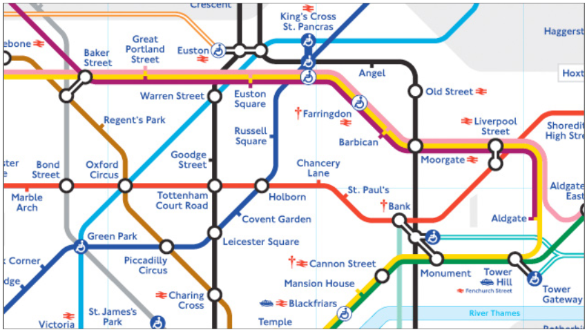

# fretboard-js
Fretboard-js is a javascript library for solving problems related to fretted string instruments. It can answer questions such as: “Is this hand position feasible to play?”or “What other positions could I move to easily from this position?” Later on we see how the algorithms which answer these type of questions can be re-engineered to produce generative compositions. In the final section, the rules underpinning the algorithm are generalised so as to be applicable to superhuman anatomy. What would it sound like to hear a guitarist with seventeen fingers on each hand play an instrument with over one hundred strings? A special synthesiser is developed to be able to model this type of situation.

The design of the fretboard is such that (disregarding pitch bend and any other special techniques) each string can be said to exists in one of a finite set of discrete states. It may be open, or it may be stopped by the first fret, or the second fret, or the third, etc. Likewise, the position of any finger can be described by two integers: the string number and the fret number. As such the positions of all four fingers (or all six string-states) can be taken together to describe the configuration of the hand on the fretboard.

## HandPosition class
The `HandPosition` class is used to represent the positions of a musician's fingers on a fretboard. This class consists of two pieces of information. The first is a vector of four coordinates, one for each finger. Each coordinate consists of two integers which assigns a string-number and a fret-number to its finger. Alternatively, a coordinate may hold a special null value if the finger should be disengaged from the fretboard. The second piece of information is a vector of Boolean (true or false) values, one for each string on the instrument. These determine whether each string should be played or left silent by the performer.
Built into the HandPosition class is the ability to render graphical versions of itself (either in classical notation or as a fretboard diagram) using the music type-setting program LilyPond. It can also generate a MIDI version of itself and find an appropriate jazz style chord symbol (if one exists).

Here are JSON representations of two `HandPosition` objects with their graphical equivalents rendered by LilyPond below.

```
// First bar:
{ fingers: [
    null,
    {fret: 2, string: 1},
    null,
    {fret: 4, string: 4},
  ],
  openStrings: [0, 4, 5],
 }
 
 // Second bar,
{ fingers: [
    {fret: 2, string:2},
    {fret: 2, string:1}, 
    {fret: 4, string:3}, 
    null
  ],
  openStrings: [0, 4, 5], 
}
```



Observations:
- Compared to the formalisation of a fretboard diagram in the previous section, the HandPosition class represents all the same information, but does so more concisely. It uses only 14 values as apposed to 72.
- Like tablature and fretboard diagrams, the HandPosition class has no pitch interpretation without also knowing the tuning of the instrument.
- A list of consecutive HandPosition objects can be assigned durations to describe the left hand movements for a piece of music.
- The HandPosition class can be extended to accommodate more (or less) than the ordinary number of human fingers, or for an instrument with any number of frets and strings in any tuning.
- The HandPosition class allows for a large number of enharmonic and/or impossible finger positions.

The HandPosition class is not without limitations:
- It cannot support barre chords.
- It does not store information about tempo, articulation, dynamics, etc.
- It is says nothing about the performer’s other hand.

**NOTE: The term “hand position” is used to refer to a the position of a hand on a fretboard including the position of each individual finger. This should not be confused with the term as it is used in by many instrumentalists to refer to the location of the hand overall along the fretboard, not taking into account the position of each finger. For the latter concept the term “playing position” is used.**

## A method to determine whether a given fingering is possible/comfortable to play.
(See src/checkFeasibility.js)

The terms ‘comfortable’ and ‘possible’ are subjective in the domain of musicianship, depending on the hands of the performer and the degree of pain which they are prepared to subject themselves for their art. In order to approach this problem computationally I have defined a third term, ‘feasible’, with an unambiguous set of rules.

### Rules for determining whether a HandPosition object is feasible
1. The hand, as a whole, should not be overstretched.

    - Compute the difference between the highest and the lowest frets in the position.
    
    - Check this value is lesser than a constant (by default this constant is four).
    
2. Fingers should not be crossed.

    - For any two fingers numbered 1-4 (index, middle, ring, little) the finger with the higher number should not be assigned a fret number which is lesser than that of the lower numbered finger.
    
3. Neighbouring fingers should not be overstretched.

    - Between any pair of adjacent fingers (1-2, 2-3 or 3-4) the difference in fret-number should be less than or equal to a constant, which by default is 2.

4. No two fingers may be on the same string.

    - There is no physical reason why a guitarist could not place two fingers on the same string, in fact this is common practice. Furthermore, the data structure outlined in §1 is perfectly capable of representing such positions.
    
    - However, this rule is included to reduce the computation complexity that results from allowing multiple fingers to share a string. Any position with two fingers on the same string has an enharmonically equivalent position (regardless of the tuning) where the finger on the lower fret is disengaged. By eliminating positions with two or more fingers on the same string from the set of feasible positions, the work the computer needs to do is reduced in most applications.
    
    - This rule may be removed in subsequent revisions of the software. Although it does not effect the set of possible *sounds* that are classed as feasible, it does subtly alter the probabilities of moving from one sound to another.
    
    - Apart from this there are no other restrictions about which strings a finger can be placed on. This too, will likely require revision.
    
5. No barre chords.

    - By definition of the data structure used to represent finger positions, a finger may be placed on exactly one fret and exactly one string, or it may be omitted. As a result, barred chords are ruled out axiomatically.
    
6. All stopped strings are played, open strings may be played or omitted.

    - Any strings which do not have fingers placed on them may be played as open strings or left silent.
    
7. Any combination of fingers may be used.

    - None, any or all of the fingers may be engaged or disengaged with the fretboard. Whether or not the fingers are engaged has no baring on the feasibility of the position.
    
8. Special consideration for the little finger (or last finger, for non-standard hands).

    - Owing to its shorter length, the final finger (little finger or pinky) may only be placed on the same fret as another finger if it is on a higher string.
    
These rules are made computationally explicit in `src/checkFeasibility.js` in the source code. This file contains a function which takes a HandPosition object as its argument (along with an optional list of parameters for customising the constants mentioned above) and returns a true or false value depending on whether it deems the position feasible or not. This function is designed to be modular - that is, it can replaced easily should the definition of feasible need revision and all other parts of the library which use checkFeasible.js will adjust to the revised definition.

## Movement between hand positions.
Having defined a (very large) set of feasible hand positions, we will want to know next how to progress from position to position. Here we encounter a problem even more subjective than the last (§2). The ease with which a hand can move from one position to another is dependent not only on the anatomy, skill and determination of the performer but also on other factors such as how much time time they have to make make the transition. As before, I have approached this hard, subjective problem by substituting it with a simpler, computable problem bound by well-defined rules. Again, a special term, *feasible step*, is loaded with a formal meaning.

### A movement between two hand positions (from **A**, to **B**) is said to be a *feasible step* if it meets all of the following criteria:

1. Both A and B are *feasible hand positions*. (This is easily tested using `checkFeasible.js`)

2. Each finger which is engaged with the fretboard in **A** remains unmoved in **B**, or becomes
disengaged.

3. Each finger which is disengaged from the fretboard in **A** may remain so in **B**. Alternatively, it __may__ be assigned any fret-string coordinate, so long as this assignment would not compromise the feasibility of the initial position (**A**), the final position (**B**) or any intermediary position.

Put less formally: In one step, any fingers which began lifted can be placed on the fretboard (once) and any which began placed down may be lifted up, but at no point may any of the rules set out in under the previous header be broken.

The rules describing a feasible step are defined in javascript in *src/move.js* and *src/allHandMoves.js*. The latter script contains two functions which take an an initial HandPosition object as their argument. allHandMoves() yields a list of all positions which are accessible in ‘one feasible movement’ from the given starting point. The other function, `randomHandMove()`, is optimised to produce a single random example from this list. In both functions, the problem is first broken down and tackled finger-by-finger in order to reach a final answer.

Whereas the set of *feasible positions* is an overestimate (there are some ‘feasible’ positions which are actually quite difficult or uncomfortable to play) the set of *feasible steps* is an underestimate: Many movements which would not trouble most performers are not included in this set. To illustrate this point, imagine lifting a finger from one position on the fretboard and putting it down on another. Perhaps counterintuitively, the software considers this *two feasible steps* (up, then down). This may appear to be a drawback, however it has the useful effect of making the computer prefer to use another finger to play the second note, which in most cases would be easier to play.

An important class of movements which are omitted from the set of feasible steps are those where a finger is slid from one fret to another without being disengaged from the string. This technique is called a slide, or portmanteau. It would be a shame not to include this characteristic gesture of guitar playing in this software. They are included using another name *feasible slides*.

### For a movement between two hand positions (from **A**, to **B**) to be a feasible slide, it must meet each of the following criteria:

1. **A** and **B** must both be *feasible hand positions*.

2. The string-numbers of each engaged finger in **B** must be the same as it was in **A**.

3. The fret-numbers of any, all or none of the fingers may change to any value in **B** or remain the same.

4. Any fingers which were disengaged in **A** must remain disengaged in **B**.

5. Likewise, any fingers which were engaged with the fretboard in **A** must remain so in **B**.

The rules defining a *feasible slide* are translated to javascript in *src/slide.js*.

### Observations:
1. The steps and slides defined above are both reversible processes. Ie, if you can step from one position to another then it is always possible to step back.

2. We can define a compound movement made up of a step followed slide, this fills in many of the gaps which make the set of feasible steps an underestimate. (See src/stepAndSlide.js in the source code.)

3. From any position, the set of positions reachable by a feasible step followed by a feasible slide is identical to the set of positions reachable by a feasible slide followed by a feasible step.

4. From the empty position (all open strings) it is possible to step to any feasible position.

5. From any position it is possible to step to the empty position.

6. Consequently, it is possible to move between any two feasible positions by taking two feasible steps (via theempty position).

7. From the empty position there is only one position accessible by a feasible slide : the empty position.

8. By feeding the output of randomHandMove() back into its input, we can generate a random walk around the fretboard which ought to be playable by a guitarist.

## Use in conjunction with a harmony transition network inducted from Bach chorales.
A **transition network** (also known as a finite state automata or finite state machine) is a type of directed graph which can be used to model the behaviour of a discrete system. They consist a discrete, finite set of ‘states’ which are connected by **‘transitions’**. A familiar and intuitive example of a transition network is a tube map, which models a journey taken on the London Underground. In this example, the stations are the states and train-lines between them represent the transitions. According to the tube map, some sequences of consecutively visited stations are permitted, and others are not. For instance, we can travel through **Barbican ↝ Moorgate ↝ Old Street ↝ Angel** but not **Moorgate ↝ Angel ↝ Oxford Circus**.



We have seen in previous sections that the calculations carried out by this software are a great deal more involved than a simple statistical model. However, once these calculations have been performed (for a given hand on a given fretboard with a given tuning) the software’s behaviour can be perfectly modelled by a transition network, albeit an extremely large one. The set of feasible hand positions are the discrete states of this network, while the feasible steps and slides are the transitions.

A special version of the fretboard program has been integrated with a transition network which statistically models chord sequences in Bach. This was produced by analysing MIDI data for all 371 chorales in the Riemenschneider collection. Unfortunately this program made its analyses in ignorance of the key of each chorale, and so the progressions that it models have a tendency to modulate in quite a confusing manner.

By superimposing these two transition networks atop one another it ought to be possible to generate music which is both comfortable to play and also has some degree of tonal harmonic continuity. In order to achieve this, it is necessary first to work out which states (hand positions) in the fretboard network correspond to which states (chord symbols) in the Bach network. This is done by calculating the pitch class set of each hand position (which naturally depends on the tuning of the strings) and comparing this to the pitch class sets implied by the chord symbols. Making these calculations in advance proves to be impractical because the fretboard network is so vast (containing millions of states). Instead, the association of hand positions and chord symbols is made on a transition-by-transition basis.

## Composing music using this software.
On the one hand, the software is capable of producing unlimited quantities of well notated musical material. This material is idiomatic in the sense that it is mechanically executable, however it is also lacking in several respects. The software is not at all concerned with rhythm, dynamics, articulation, or indeed anything to do with the player’s right hand. With the knowledge the material was at best 50% of a piece of music, I presented it to Pablo with an additional blank stave so that he might have creative freedom to compose those parameters that the computer ignored. I hoped to offer this material as a source a source of inspiration rather than as a prescriptive and difficult piece of music (as would very easily become the case given the software’s rigorous attention to fingerings and sometimes optimistic assumptions about what it can expect from the performer.) This correspondence with Pablo also prompted a few revisions to the rules of feasibility and the notation.

## Problems, possible applications and further research.
There remain a few notational issues in this software. Some are minor and easily resolved: it often reiterates fingering numbers unnecessarily and is not intelligent in its spelling of accidentals. Others require more thought: in order for the project to develop further a more nuanced sub-routine for type-setting rhythms will become necessary; also the possibility for writing multiple voices may be desirable if it is to be put to use composing contrapuntal guitar music.

Other problems have to do with the limited scope of the project. It currently has no support for barre chords or for other techniques central to string instruments such as harmonics, hammer-ons/pull-offs or pitch-bends. In particular, the total omission of the players second non-fingerboard hand surely also ought to be addressed moving forwards.

Problems aside, a few practical applications of this code suggest themselves. It might be possible to extend the program so that it can automatically adapt music for performance on a fretted instruments. It could produce reductions from keyboard or orchestral arrangements. Alternatively it could be used to transcribe fretted- instrument music from one tuning to another. Another possible application could take the form of a software plug-in for programs like Sibelius or Finale, in order to flag up errors and unrealistic expectations made by composers, or to automatically work out suggested fingerings for their work.

Given that most music for instruments in the violin family and other non-fretted string instruments is generally written for the tempered chromatic scale, this software could readily be adapted to suit the needs of those instruments too. If the rules of feasibility were adapted for a continuous (rather than fretted) fingerboard then they could be used in complicated microtonal situations too.

A rather fanciful future project I would like to pursue is to design a board game based on this software. Like a board game this software works in a domain consisting of discrete positions on a board and discrete moves between those states, all that is missing is some objective for the players of the game to play for. It seems dubious whether such a game would be any fun to play, but the real purpose of this project would be to subject it to an analysis using game theory. If computers could be taught to play the game against one another then this could become a novel source of generative music.
